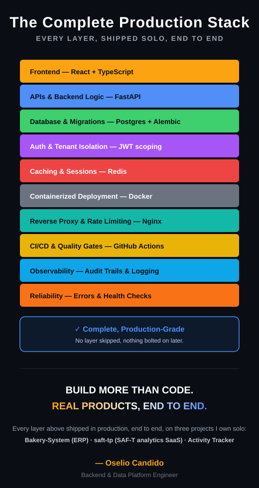

**Backend & data platform engineer building reliable SaaS systems and data platforms on Databricks — increasingly with AI agents as part of the toolchain.**

I work across the stack from PostgreSQL schema design up through FastAPI services to production CI/CD. I care more about correctness, explicit boundaries, and systems that fail predictably than about chasing frameworks.

## What I Build

- **Backend APIs & services** — async FastAPI services backed by SQLAlchemy/asyncpg, structured around domain-driven layering (domain → application → infrastructure → presentation)
- **SaaS products** — contributing to a multi-tenant booking SaaS for service businesses (tenant isolation enforced at the application layer), plus smaller SaaS products I build solo end to end
- **Databricks lakehouse pipelines** — layered Delta pipelines with incremental loads, environment-aware orchestration, and Asset Bundle-driven deployments
- **Data pipelines** — dbt + PostgreSQL pipelines on AWS
- **Quality & CI/CD infrastructure** — enforced coverage/complexity/lint gates wired into layered pipelines (unit, integration, security, quality) across GitHub Actions and GitLab CI

## Engineering Interests

Data modeling · API design · authentication & authorization · data governance · CI/CD quality gates · pragmatic, tool-assisted engineering

## Technology Stack

**Backend:** Python · FastAPI · async SQLAlchemy · asyncpg · Alembic · Pydantic

**Data:** SQL · PostgreSQL · Databricks (Delta Lake, Unity Catalog, Asset Bundles) · dbt · ETL/ELT pipelines

**Infrastructure:** Docker · Docker Compose · Nginx · Linux · Redis · AWS S3 · Terraform · GitHub Actions & GitLab CI/CD

**Frontend:** TypeScript · React

**Engineering practice:** Git · automated quality gates (coverage, mypy, ruff, radon) · testing (pytest, unit + integration) · CI/CD security & dependency vulnerability scanning

    
    
    
    
    
    
    
    
    
    

## Agentic Development

I use Claude Code as my primary development tool — its native harness (hooks, skills, custom agents) rather than a heavier SDK-based agent framework. I've moved off GitHub Copilot entirely; Claude Code is what I use day to day now. I've also built with the OpenAI Agents SDK before, but for my own projects I stick to simplicity: plain markdown + frontmatter for agents and skills solves the problem without extra orchestration layers. I write PRDs to scope work, but don't follow formal spec-driven development — the spec informs the build, it doesn't drive a rigid process.

## Engineering Philosophy

- Model the domain before choosing abstractions.
- Prefer explicit boundaries over implicit magic.
- Treat the database as part of the correctness model, not an afterthought.
- Apply the same schema-migration discipline to lakehouse tables as to relational databases (Alembic against Databricks catalogs, not ad hoc DDL).
- Automate the parts of engineering that don't require judgment — quality gates, not code review.
- Use AI agents as engineering tools with enforced guardrails, not as a replacement for engineering judgment.
- Prefer a simple architecture until complexity is actually justified.

## Current Focus

Contributing backend work to a multi-tenant booking SaaS for service businesses (salons, clinics), alongside a few full-stack products I build solo end to end:

- **Bakery-System** — an ERP for a bakery business: inventory purchasing decisions, financials, and staff management in one system
- **saft-tp** — a SaaS that turns Portuguese SAF-T fiscal invoice data into sales, product, and customer analytics for small businesses
- **Activity Tracker** — a shared activity/reminder tracker for a small team, with a full audit trail and live cross-device notifications

(These three are private repos for now.)

  

## Contact

[LinkedIn](https://linkedin.com/in/oseliocandido) · [Blog](https://oseliocandido.tech)
