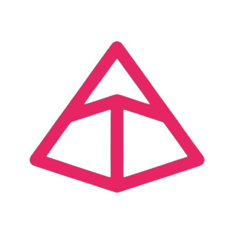

#  💬 About me

Hi, my name is Oselio, a Data Engineerfrom Brazil living currently in Portugal.

- 🖥️ Diving into concepts beyond basic knowledge, constantly refining my skills to build scalable solutions.
- 🤖 Manual tasks are boring, thus I tend to automate everything.

## 🔗 Social 

## 🛠️ Tech Stack  

**🚀 Programming** Python, SQL  
**🗄️ Data Engineering:** dbt, BigQuery, Databricks  
**🗃️ Databases:** SQL Server, PostgreSQL  
**☁️ Cloud Platforms:** AWS (S3, EC2)  
**⚙️ Orchestration:** Azure Data Factory  
**🧩 API Development:** FastAPI  
**🐋 DevOps & Containerization:** Docker  
**📊 Data Visualization:** Power BI, Streamlit, DAX  
**✅ Data Quality & Validation:** pydantic

    
    
    
    
    
    
    
    
    
    

##  🧑‍💻 Current Focus
- 📚 Sharpening my CS knowledge to drive architecture improvements and feature additions for my system.
